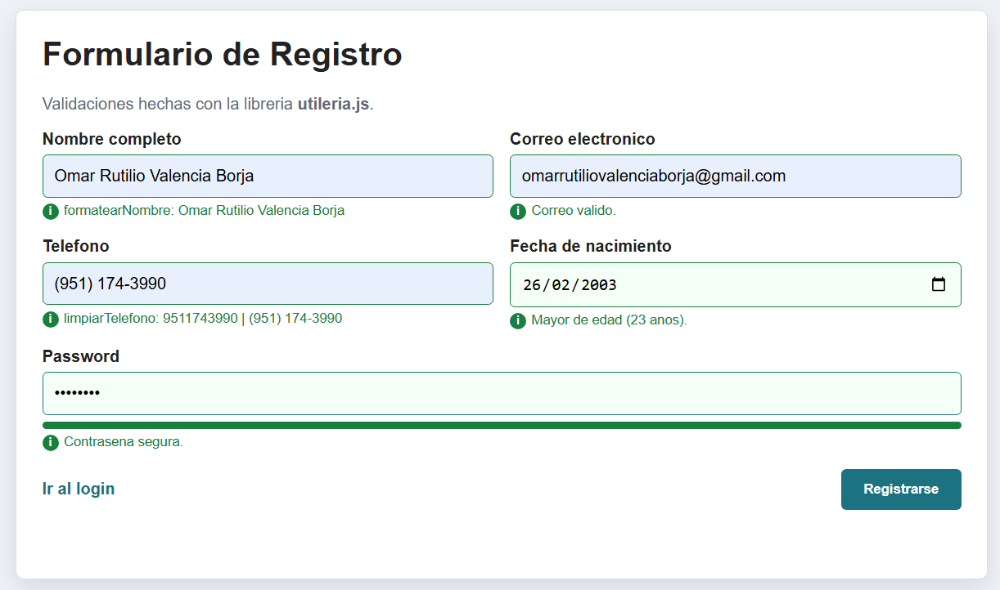
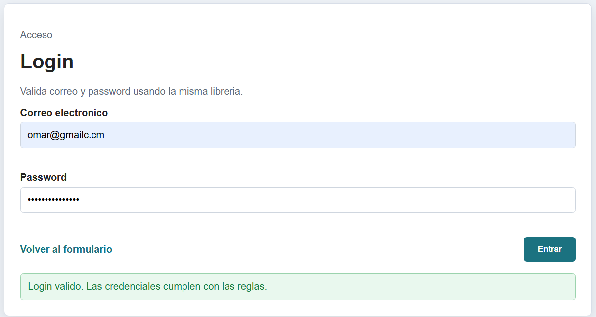

# Utileria JS para formularios

Esta libreria resuelve validaciones comunes para formularios HTML sin usar frameworks. Incluye validacion de correo, nombres con letras, longitud, edad, mayoria de edad, password seguro y dos funciones extra para formatear nombres y limpiar telefonos.

## Instalacion

Agrega el archivo JavaScript antes de cerrar el `body`:

```html
<script src="js/utileria.js"></script>
```

## Funciones incluidas

### validarCorreo(correo)

Valida que un correo tenga formato basico correcto.

```js
validarCorreo("ana@correo.com"); // true
validarCorreo("ana-correo.com"); // false
```

### soloLetras(texto)

Valida que el texto tenga solo letras, espacios y vocales acentuadas.

```js
soloLetras("Jose Alvarez"); // true
soloLetras("Jose123"); // false
```

### validarLongitud(numero, maxLongitud)

Convierte el valor a texto y valida que su longitud no pase del maximo indicado.

```js
validarLongitud(12345, 5); // true
validarLongitud(123456, 5); // false
```

### calcularEdad(fechaNacimiento)

Calcula la edad entera a partir de una fecha de nacimiento.

```js
calcularEdad("2000-05-10"); // devuelve la edad actual
```

### esMayorDeEdad(fechaNacimiento)

Valida si la persona tiene 18 anos o mas.

```js
esMayorDeEdad("2000-05-10"); // true
esMayorDeEdad("2012-05-10"); // false
```

### validarPassword(password)

Requiere minimo 8 caracteres, una mayuscula, una minuscula, un numero y un caracter especial.

```js
validarPassword("Hola123!"); // true
validarPassword("hola1234"); // false
```

## Funciones adicionales

### formatearNombre(texto)

Limpia espacios, convierte a minusculas y pone mayuscula inicial en cada palabra.

```js
formatearNombre("  aNA   gArCiA  "); // "Ana Garcia"
```

### limpiarTelefono(telefono)

Elimina todo lo que no sea numero.

```js
limpiarTelefono("(999) 123-4567"); // "9991234567"
```

## Ejemplo de uso real

```html
<input id="correo" type="email">
<input id="password" type="password">
<button id="btn">Validar</button>

<script src="js/utileria.js"></script>
<script>
  document.getElementById("btn").addEventListener("click", () => {
    const correo = document.getElementById("correo").value;
    const password = document.getElementById("password").value;

    if (validarCorreo(correo) && validarPassword(password)) {
      alert("Datos validos");
    } else {
      alert("Revisa tu correo o password");
    }
  });
</script>
```

## Integracion del proyecto

El repositorio contiene:

- `index.html`: formulario con validaciones y ventana modal que muestra la edad calculada.
- `login.html`: pantalla de login que usa `validarCorreo` y `validarPassword`.
- `js/utileria.js`: libreria funcional sin frameworks.
- `js/formulario.js`: codigo del formulario para mantener el HTML mas ordenado.
- `css/styles.css`: estilos para formulario, login y modal.

## Capturas de pantalla

Formulario funcionando con modal de edad:



Login validado:



## Video corto

Agrega aqui el enlace de tu video demo cuando lo grabes:

```md
https://tu-enlace-del-video.com
```
