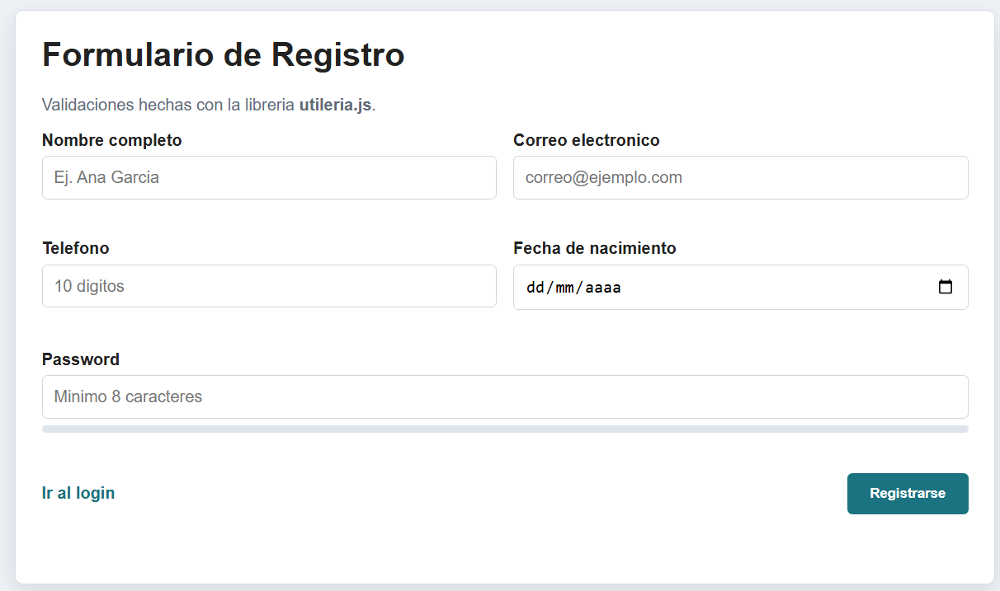
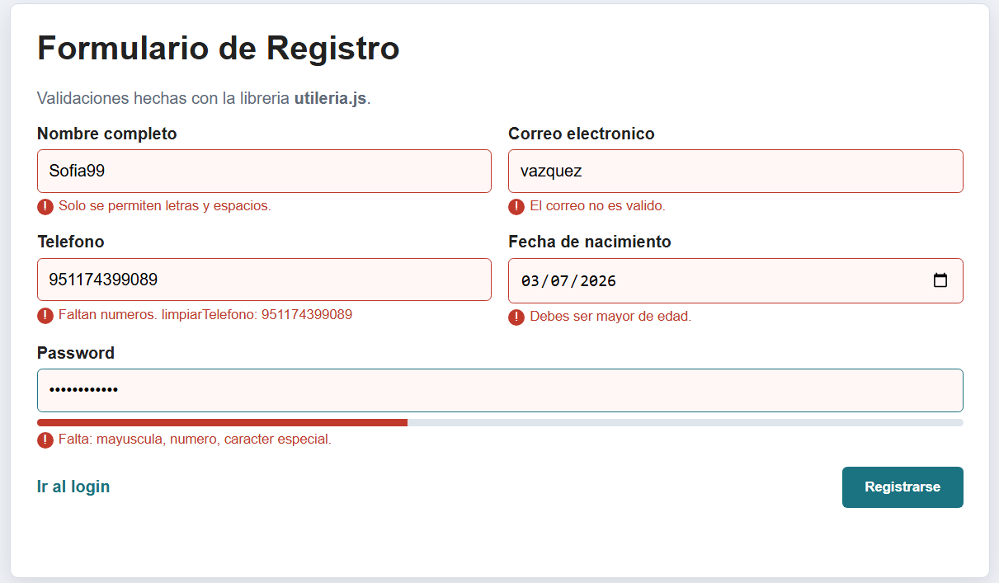
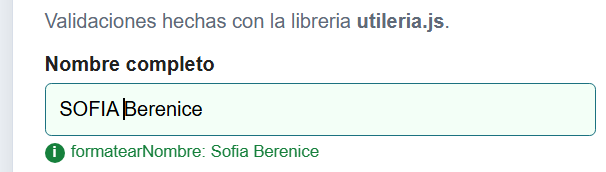
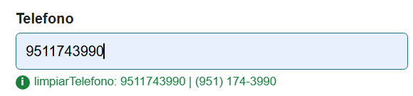
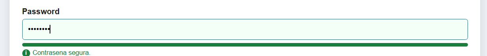
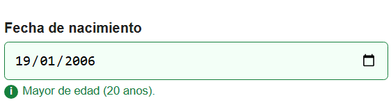
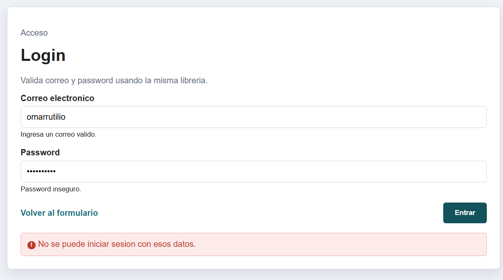
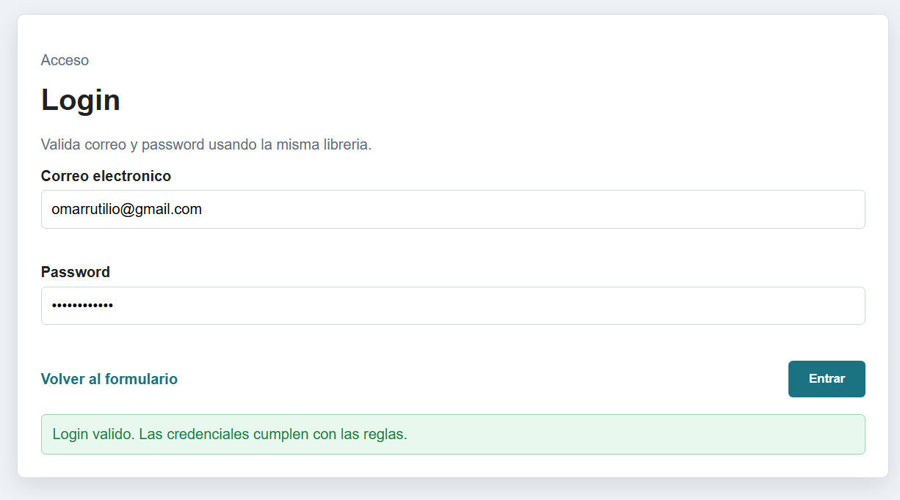

<div align="center">

# TECNOLOGICO NACIONAL DE MEXICO

## INSTITUTO TECNOLOGICO DE OAXACA

**Departamento de Ingenieria en Sistemas Computacionales**

<br>


<br>

**Materia:** Programacion Web  
**Actividad:** Actividad 2. Libreria `utileria.js`

<br>

**Docente:** Martinez Nieto Adelina  
**Grupo:** 7D  
**Alumno:** Valencia Borja Omar Rutilio  
**Numero de control:** 22161258

<br>

**Oaxaca, Oaxaca, 29 de mayo de 2026**

</div>

---

# Utileria JS para formularios

## Nota sobre la imagen de portada

La imagen principal de la portada debe guardarse dentro de la carpeta `img` con este nombre exacto:

```txt
img/00-portada-logo.png
```

Puede ser el logo de la escuela, el logo de la carrera o una imagen relacionada con programacion web. Si usas una captura parecida a la que mostraste, recortala para que solo se vea el logo central y no toda la hoja completa.

## Descripcion del proyecto

Esta libreria ayuda a validar datos comunes de formularios HTML, como correo, nombre, telefono, edad y contrasena segura, usando JavaScript puro y sin frameworks.

El proyecto incluye una libreria llamada `utileria.js` y dos paginas de ejemplo:

- `index.html`: formulario de registro con validaciones, barra de contrasena y modal de edad.
- `login.html`: login que valida correo y contrasena.

## Instalacion

Para usar la libreria en cualquier archivo HTML, se agrega este script antes de cerrar el `body`:

```html
<script src="js/utileria.js"></script>
```

En el formulario tambien se carga este archivo:

```html
<script src="js/formulario.js"></script>
```

`formulario.js` no es otra libreria. Se agrego para separar el codigo del formulario y evitar que `index.html` tuviera demasiadas lineas de JavaScript. Asi el HTML queda mas ordenado: `index.html` contiene la estructura, `utileria.js` contiene las funciones reutilizables y `formulario.js` conecta esas funciones con los campos del formulario.

## Estructura del proyecto

```txt
/utileria
- README.md
- index.html
- login.html
- /css
  - styles.css
- /js
  - utileria.js
  - formulario.js
- /img
  - capturas del proyecto
```

## Funciones obligatorias

### validarCorreo(correo)

Valida que el correo tenga un formato correcto.

```js
validarCorreo("ana@correo.com"); // true
validarCorreo("ana-correo.com"); // false
```

Linea importante de la funcion:

```js
const patronCorreo = /^[^\s@]+@[^\s@]+\.[^\s@]{2,}$/;
```

Esta expresion regular revisa que exista texto antes del `@`, texto despues del `@`, un punto y una terminacion como `.com`.

### soloLetras(texto)

Valida que el nombre tenga solamente letras y espacios. Tambien acepta letras con acentos.

```js
soloLetras("Jose Alvarez"); // true
soloLetras("Jose123"); // false
```

Linea importante:

```js
const patronLetras = /^[A-Za-z\u00C0-\u017F\s]+$/;
```

`\u00C0-\u017F` permite letras acentuadas como `á`, `é`, `ñ`, etc.

### validarLongitud(numero, maxLongitud)

Valida que un numero no pase de cierta cantidad de caracteres.

```js
validarLongitud(12345, 5); // true
validarLongitud(123456, 5); // false
```

Esta funcion se usa en el telefono para comprobar que el numero tenga la longitud correcta.

### calcularEdad(fechaNacimiento)

Calcula la edad de una persona usando su fecha de nacimiento.

```js
calcularEdad("2000-05-10"); // devuelve la edad actual
```

Parte importante:

```js
let edad = hoy.getFullYear() - nacimiento.getFullYear();
```

Despues se revisa el mes y dia para saber si la persona ya cumplio anos este ano.

### esMayorDeEdad(fechaNacimiento)

Valida si una persona tiene 18 anos o mas.

```js
esMayorDeEdad("2000-05-10"); // true
esMayorDeEdad("2012-05-10"); // false
```

Linea importante:

```js
return calcularEdad(fechaNacimiento) >= 18;
```

Esta funcion reutiliza `calcularEdad`, por eso no se repite el mismo calculo.

### validarPassword(password)

Valida que la contrasena sea segura. Debe tener:

- minimo 8 caracteres
- una mayuscula
- una minuscula
- un numero
- un caracter especial

```js
validarPassword("Hola123!"); // true
validarPassword("hola1234"); // false
```

Lineas importantes:

```js
const tieneMayuscula = /[A-Z]/.test(password);
const tieneMinuscula = /[a-z]/.test(password);
const tieneNumero = /\d/.test(password);
const tieneEspecial = /[^A-Za-z0-9]/.test(password);
```

Cada linea revisa un requisito diferente de la contrasena.

## Funciones adicionales

### formatearNombre(texto)

Esta funcion limpia espacios extra, convierte el texto a minusculas y pone mayuscula al inicio de cada palabra.

```js
formatearNombre("  oMAR   vALENCIA  "); // "Omar Valencia"
```

En el formulario se muestra debajo del campo de nombre para comprobar que la funcion se esta usando.

### limpiarTelefono(telefono)

Esta funcion elimina todo lo que no sea numero.

```js
limpiarTelefono("(951) 174-3990"); // "9511743990"
```

En el formulario se muestra el telefono limpio y tambien el telefono con formato visual.

## Integracion con index.html

El formulario de `index.html` usa las funciones de la libreria en tiempo real.

Ejemplo del campo nombre:

```js
if (!soloLetras(nombre.value)) {
  mensaje("nombreMensaje", "Solo se permiten letras y espacios.", "error");
  pintarInput(nombre, false);
  return false;
}

var nombreFinal = formatearNombre(nombre.value);
mensaje("nombreMensaje", "formatearNombre: " + nombreFinal, "ok");
```

Aqui se usan dos funciones:

- `soloLetras`: revisa que el nombre no tenga numeros.
- `formatearNombre`: muestra el nombre corregido.

Ejemplo del campo telefono:

```js
var limpio = limpiarTelefono(telefono.value);
var correcto = limpio.length === 10;
```

Primero se limpia el telefono con `limpiarTelefono` y despues se valida que tenga 10 digitos.

Ejemplo de la barra de contrasena:

```js
passwordBar.style.width = (puntos * 20) + "%";
```

La barra aumenta segun los requisitos que cumple la contrasena. Como son 5 requisitos, cada punto vale 20%.

## Integracion con modal

Cuando el formulario esta correcto, se calcula la edad y se muestra una ventana modal.

```js
var edad = calcularEdad(fechaNacimiento.value);
modalTexto.textContent = nombreFinal + ", tu edad calculada es " + edad + " anos.";
modal.style.display = "flex";
```

El modal sirve para demostrar que `calcularEdad` funciona dentro de una interfaz real.

## Integracion con login.html

El archivo `login.html` usa dos funciones de la libreria:

- `validarCorreo`
- `validarPassword`

Ejemplo:

```js
if (!validarCorreo(correo)) {
  correoError.textContent = "Ingresa un correo valido.";
}

if (!validarPassword(password)) {
  passwordError.textContent = "Password inseguro.";
}
```

Esto demuestra que `utileria.js` se puede usar en mas de una pagina.

## Capturas de pantalla

Guarda tus capturas dentro de la carpeta `img` con estos nombres exactos para que se vean en el README.

### 1. Formulario vacio

Toma esta captura al abrir `index.html`, antes de escribir datos.

Nombre del archivo:

```txt
img/01-formulario-vacio.png
```



### 2. Advertencias del formulario

Toma esta captura despues de escribir datos incorrectos, por ejemplo:

- nombre con numeros
- correo sin `@`
- telefono incompleto
- fecha de menor de edad
- password debil

Debe verse que aparecen mensajes rojos.

Nombre del archivo:

```txt
img/02-advertencias-formulario.png
```



### 3. Funcion formatearNombre

Toma esta captura escribiendo un nombre desordenado, por ejemplo:

```txt
oMAR   rUTiLiO   vALENCIA
```

La captura debe mostrar el mensaje donde aparece el resultado de `formatearNombre`.

Nombre del archivo:

```txt
img/03-formatear-nombre.png
```



### 4. Funcion limpiarTelefono

Toma esta captura escribiendo el telefono con simbolos, por ejemplo:

```txt
(951) 174-3990
```

La captura debe mostrar el numero limpio:

```txt
9511743990
```

Nombre del archivo:

```txt
img/04-limpiar-telefono.png
```



### 5. Barra de contrasena

Toma esta captura mientras escribes una contrasena incompleta para que se vea que falta algo.

Ejemplo:

```txt
Hola12
```

Luego puedes tomar otra con contrasena segura:

```txt
Hola123!
```

Nombre del archivo:

```txt
img/05-barra-password.png
```



### 6. Registro exitoso y modal

Toma esta captura con todos los datos correctos y el modal abierto mostrando la edad calculada.

Nombre del archivo:

```txt
img/06-modal-edad.png
```



### 7. Login con errores

Toma esta captura en `login.html` con un correo incorrecto o password inseguro.

Nombre del archivo:

```txt
img/07-login-error.png
```



### 8. Login correcto

Toma esta captura en `login.html` usando un correo valido y una contrasena segura.

Nombre del archivo:

```txt
img/08-login-correcto.png
```



## Video corto

En el video se puede mostrar este orden:

1. Abrir `index.html`.
2. Escribir datos incorrectos para mostrar las advertencias.
3. Corregir el nombre y mostrar `formatearNombre`.
4. Corregir el telefono y mostrar `limpiarTelefono`.
5. Escribir una contrasena y mostrar como sube la barra.
6. Enviar el formulario y mostrar el modal con la edad.
7. Abrir `login.html` y validar correo y contrasena.

Pega aqui el enlace del video:

```txt
https://tu-enlace-del-video.com
```

## Conclusion

Esta libreria permite reutilizar funciones de validacion en diferentes paginas. El formulario y el login demuestran que las funciones no solo estan escritas, sino integradas en casos reales.
